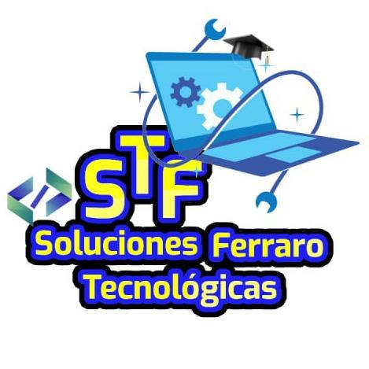

#Este es el codigo para el curso de Fundamentos de Programacion en Python

Codigo de programacion con ejercicios en Python

Este curso es creado por Gerardo Alî Ferraro Schelijasch

El objetivo es compartir informacion y codigo a traves de este repositorio para que los participantes tengan la oportunidad de revisar el codigo visto en cada clase y una solucion a los problemas o desafios que se enfrentan en el curso!.

